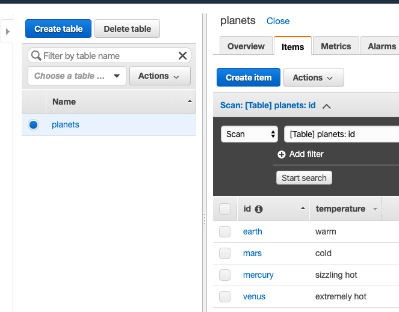

## AWS Lambda with Python

- [Intro to AWS Lambda with Python](https://www.youtube.com/watch?v=-8L4OxotXlE)
- [Boto3 API documentation](https://boto3.amazonaws.com/v1/documentation/api/latest/reference/core/collections.html)
##### Simple example
```python
import json

def lambda_handler(event, context):
    """
    event, context - lambda specific parameters
    """
    return {
        'statusCode': 200,
        'body': json.dumps('Hello from Lambda!')
    }

```

##### Read from S3 bucket
Note: Give your Lambda correct permissions to get access to AWS S3 resources
```python
import json
import boto3

s3 = boto3.resource('s3')

def lambda_handler(event, context):
    bucket_list = []
    for bucket in s3.buckets.all():
        print(bucket.name)
        bucket_list.append(bucket.name)
    return {
        "statusCode": 200,
        "body": bucket_list
    }
```
*Execution result:*
```json
{
  "statusCode": 200,
  "body": [
    "bucket-us-east-1-1234567",
    "bucket-us-east-1-1234567-backup",
    "bucket-us-east-1-1234568",
    "bucket-us-east-2-1234569"
  ]
}
```

##### DynamoDB
1. Create table 'planets'
2. Create items



**Get Item**
```python
import json
import boto3

dynamodb = boto3.resource('dynamodb')

table = dynamodb.Table('planets')

def lambda_handler(event, context):
    
    response = table.get_item(
        Key={'id': 'mercury'}
    )
    print(response)
    return {
        'statusCode': 200,
        'body': response
    }
```
*Execution result:*
```json
{
  "statusCode": 200,
  "body": {
    "Item": {
      "id": "mercury",
      "temperature": "sizzling hot"
    },
    "ResponseMetadata": {
      "RequestId": ".....",
      "HTTPStatusCode": 200,
      "HTTPHeaders": {
        "server": "Server",
        "date": "Thu, 16 Jan 2020 19:37:01 GMT",
        "content-type": "application/x-amz-json-1.0",
        "content-length": "66",
        "connection": "keep-alive",
        "x-amzn-requestid": "......",
        "x-amz-crc32": "...."
      },
      "RetryAttempts": 0
    }
  }
}
```

**Put Item**

```python
import json
import boto3

dynamodb = boto3.resource('dynamodb')

table = dynamodb.Table('planets')

def lambda_handler(event, context):
    
    table.put_item(
        Item={
            'id': 'neptun',
            'temperature': 'super cold'
        }
    )
    return {
        'statusCode': 200,
        'body': 'Item Added!'
    }
``` 
*Execution result:*
```json
{
  "statusCode": 200,
  "body": "Item Added!"
}
```